# 🥗 FoodVision – AI-Powered Diet & Consultancy Platform

<div align="center">


**AI-powered personalized nutrition with professional consultancy – all in one app**

</div>

---

## **Overview**

FoodVision is a comprehensive mobile application that revolutionizes personal nutrition by combining **AI-powered meal planning** with **professional nutritionist consultations**. Whether you're looking to lose weight, build muscle, or simply eat healthier, FoodVision creates personalized diet plans tailored to your unique goals, preferences, and lifestyle.

### **What Makes FoodVision Different?**

- **AI-Powered Personalization** – Not just generic advice, but truly personalized meal plans
- **Professional Consultancy** – Book sessions with certified nutritionists
- **Real-time Tracking** – Monitor calories, macros, and progress effortlessly
- **Goal-Oriented** – Whether weight loss, muscle gain, or healthy living
- **Dark & Light Mode** – Beautiful UI that adapts to your preference

---

## **Features**

### 🥘 **For Users**
- **AI Recipe Generator** – Generate personalized recipes from ingredients or preferences
- **Daily Meal Planning** – Get customized meal plans for each day
- **Macro & Calorie Tracking** – Track protein, carbs, fats, and calories in real-time
- **Smart Recommendations** – AI suggests meals based on your history and goals
- **Progress Dashboard** – Visual progress tracking with charts and streaks
- **Recipe Details** – Complete nutritional breakdown for every recipe

### 👨‍⚕️ **For Nutritionists**
- **Client Management** – Track all your clients in one place
- **Consultation Booking** – Clients can book time slots directly
- **Session Management** – Start sessions, take notes, and track progress
- **Diet Plan Creation** – Create expert diet plans for clients
- **Pre-Consultation Forms** – Review client goals before sessions
- **Professional Dashboard** – Stats, upcoming sessions, and quick actions

### 💬 **AI Nutrition Chat**
- Get instant answers to nutrition questions
- Meal suggestions based on your preferences
- Calorie calculations and macro breakdowns
- Smart diet adjustments

---

## 🎨 **Screenshots**

<div align="center">

| User Side | Nutritionist Side |
|-----------|-------------------|
| 🏠 Home Dashboard | 📊 Professional Dashboard |
| 🍽️ Meal Tracking | 👥 Client Management |
| 🤖 AI Recipe Generator | 📋 Diet Plan Creator |
| 📅 Book Consultation | 📝 Session Notes |
| 📊 Progress Tracking | 👤 Profile Management |

</div>

---

## **Tech Stack**

<div align="center">

| Technology | Purpose |
|------------|---------|
| **React Native (Expo)** | Cross-platform mobile app |
| **Expo Router** | File-based navigation & routing |
| **Firebase Auth** | Secure user authentication |
| **Convex** | Real-time database & backend logic |
| **OpenRouter / Gemini API** | AI-powered nutrition intelligence |
| **AsyncStorage** | Local data persistence |
| **React Native Reanimated** | Smooth animations & transitions |

</div>

---

## **Getting Started**

### **Prerequisites**

Before you begin, ensure you have:

- ✅ **Node.js** (v18 or higher)
- ✅ **npm** or **yarn**
- ✅ **Expo Go** app on your mobile device (for testing)
- ✅ A **Firebase** project with Authentication enabled
- ✅ A **Convex** project (free tier available)
- ✅ An **OpenRouter** API key (for AI features)

### **Installation**

1. **Clone the repository**
   ```bash
   git clone https://github.com/codeshivam-dev/FoodVision-App.git
   cd FoodVision-App
   ```

2. **Install dependencies**
   ```bash
   npm install
   ```

3. **Set up environment variables**

   Create a `.env.local` file in the root directory:
   ```env
   # Convex Configuration
   CONVEX_DEPLOYMENT=dev:your-deployment-name
   EXPO_PUBLIC_CONVEX_URL=https://your-project.convex.cloud

   # Firebase Configuration
   EXPO_PUBLIC_FIREBASE_API_KEY=your-firebase-api-key

   # AI Configuration
   EXPO_PUBLIC_OPENROUTER_API_KEY=your-openrouter-api-key
   ```

4. **Start Convex development server**
   ```bash
   npx convex dev
   ```

5. **Run the app**
   ```bash
   npx expo start or npm start
   ```

6. **Open on your device**
   - Scan the QR code with **Expo Go** (iOS/Android)
   - Or press `a` for Android emulator / `i` for iOS simulator

---

## **Architecture**

<div align="center">
  
</div>

The diagram above shows how FoodVision connects users with AI-powered meal planning 
and professional nutritionist consultations through a modern serverless architecture.

## **Key Features in Action**

### **AI Recipe Generation**
1. Enter ingredients or preferences
2. AI generates multiple recipe options
3. Select and view detailed nutritional info
4. Add to your meal plan with one tap

### **Nutritionist Consultation**
1. Browse certified nutritionists
2. Book a time slot
3. Fill pre-consultation form
4. Attend online/in-person session
5. Get expert diet plan

### **Progress Tracking**
- Weekly adherence charts
- Weight tracking
- Macro breakdowns
- Achievement badges
- Streak tracking

---

## **Contributing**

We welcome contributions! Here's how you can help:

1. **Fork** the repository
2. **Create** a feature branch:
   ```bash
   git checkout -b feature/amazing-feature
   ```
3. **Commit** your changes:
   ```bash
   git commit -m 'Add amazing feature'
   ```
4. **Push** to the branch:
   ```bash
   git push origin feature/amazing-feature
   ```
5. **Open** a Pull Request

### **Contribution Guidelines**
- Follow the existing code style
- Add proper TypeScript types
- Test on both iOS and Android
- Update documentation as needed

---

## **License**

This project is licensed under the MIT License – see the [LICENSE](LICENSE) file for details.

---

## **Acknowledgments**

- **Expo Team** – Amazing React Native framework
- **Convex** – Powerful real-time backend
- **OpenRouter** – AI model access
- **Firebase** – Reliable authentication
- **All Contributors** – Who help improve FoodVision

---

## **Contact & Support**

<div align="center">

[](https://github.com/codeshivam-dev)
[](https://github.com/codeshivam-dev/FoodVision-App/issues)

**Made with ❤️ for better nutrition**

</div>

---

**⭐ Don't forget to star this repo if you find it useful! ⭐**